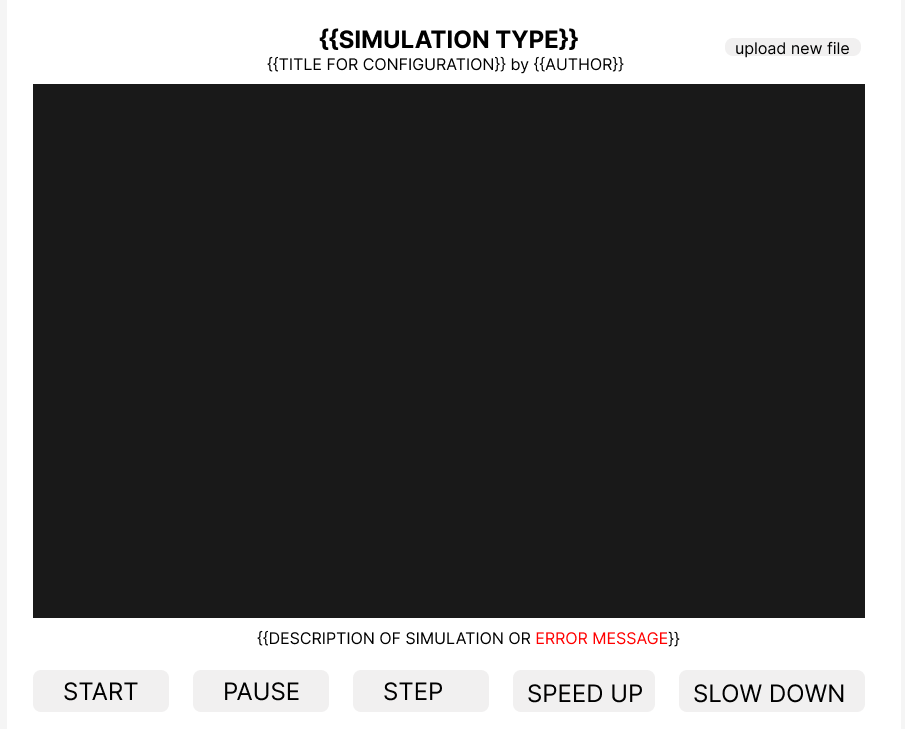
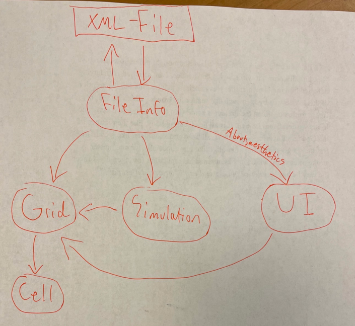

# Cell Society Design Plan
### Team Number 06
### Aryan Kothari (ak616), Charles Turpin (cht16), and Trevon Helm (tmh85)


## Overview

Make a program that can simulate various kinds of CA models, by reading in 
XML configurations that specify type, title, author, extra parameters, 
grid size/initial layout. This will be shown to the user through a graphical
interface that will allow the user to start, pause, stop, load,
and save a specific instance of a simulation at a certain time.

## User Interface



Error messages would appear for an incorrect input being loaded (such as a bad or
blank file), though if there is no error message, we are planning for the description
of the simulation to take its place underneath the grid.

[Link to the Figma page](https://www.figma.com/file/Lji69uPnsIKGH0pHDbOxKe/Cell-Society-UI-Design?node-id=0%3A1&t=bwLht2BhPgLRISpE-1/)


## Configuration File Format

Example 1:

```xml
<?xml version="1.0" encoding = "UTF-8" ?>

<!--
Done with the help of
https://www.youtube.com/watch?v=w3WibDOie1Y
and
https://www.w3schools.com/xml/xml_dtd_el_vs_attr.asp
and
https://www.tutorialspoint.com/xml/xml_comments.htm
-->

<Simulations>
	<Simulation>
    	<type>Game of Life</type>
    	<title>Conway's Thing</title>
    	<author>conway123</author>
    	<description> I expect to see the cells be created and destroyed in ways I cannot predict. This is an interesting example because of how it takes a simple ruleset and goes off to do something amazing. </description>
    	<width>4</width>
    	<height>4</height>
<!-- 0 = Dead, 1 = Alive -->
    	<initconfig>
        0,0,1,0,
        0,0,1,1,
        0,0,0,0,
        0,0,0,0
        </initconfig>
    	<extra>0</extra>
	</Simulation>
</Simulations>
```

Example 2:

```xml
<?xml version="1.0" encoding = "UTF-8" ?>

<Simulations>
	<Simulation>
    	<type>Fire Spreader</type>
    	<title>Forest Fire Simulation</title>
    	<author>smokeyBear</author>
    	<description> I expect to see a simulation of how fire spreads in a forest. I expect the fire to start small, then spread fast. This is an interesting example because it shows how a small spark can lead to something drastic. </description>
    	<width>4</width>
    	<height>4</height>
    	<initconfig>
        0,0,1,1,
        0,0,0,1,
        0,0,0,0,
        0,0,0,0
        </initconfig>
    	<extra= 'probCatch'>0.5</extra>
    	<extra= 'probReSpark'>0.2</extra>
	</Simulation>
</Simulations>
```


## Design Overview



As of right now, our plan is to have the FileInfo class read the XML file and store
the data inside the class itself. All other classes (except the Cell) will then
read from this class to get the data that it needs.

The Grid class will manage the actual cellular automata grid, telling the cells whether
they should be active or not and when. It will be influenced by the Simulation class,
which checks the rules and tells the Grid whether a cell should be alive or not.
The cells themselves are controlled by the Grid, turning themselves on and off 
depending on what the Grid says.

Finally, the UI will be the "frontend" of the program, reading the grid and displaying
its contents to the user, and reading the FileInfo class to reveal biographical information
to the user about the simulation.

## Design Details

Multiple classes:

* Cell
    * Manage the properties related to each individual cell (such as current and next state)
* Grid
  * Manage state of the grid
* UI 
  * Update and maintain the graphical interface.
  * Manage user inputs provided via the user interface
* Simulation
  * Manage the rules specific to the type of simulation
* FileInfo
  * read in files, XML, txt, etc for setting simulation and reading in rules

Abstractions:

The core classes (Grid, Cell, UI, Simulation, FileInfo) will have base methods
needed to make the program run, and the methods that are important to program
functionality will be hidden/private. This allows new programmers to add/extend
functionality without modifying the core code of the program by creating
subclasses as necessary.

Potential Subclasses:

* Simulation: Subclass for each simulation to hold its rules 
    (Game of Life, Fire Spreader, Wa-Tor, etc.)

* UI: Subclasses of different UI layouts. 
  * May be useful if the Grid is skewed vertically or horizontally.

#### Initial Draft of Classes and some Methods:
```java
public class Grid {
     // Returns the number of active neighbors around a given cell
     public int checkActiveNeighbors (Cell[][] cell);
    //update the currentState and nextState values
     Public void updateCurrentStates();
     // Set all cells in the grid to a dead state.
     Public void clear();
     // Given a 2D array of booleans, update the cells to match the starting config
     Public void loadInitial(boolean[][] startingConfig);
     // Stop the flow of time for the grid; do not go to the next generation.
     Public void pause();
     
 }
 ```

```java
public class Cell {
     Boolean nextState;
     Boolean isEdge;
     Boolean currentState;
     // update the nextState of the Cell object
     public void updateNextState (boolean nextState);
     //returns the value of isEdge
     Public boolean getMiddleCell();
 }
```


```java
public class Simulation {
    // Check for whether a cell should be dead (false) or alive (true) depending
    // on the cell's number of active neighbors and whether they are an edge cell
    Public boolean checkRules(int numActiveNeighbours, Boolean isMiddleCell);
    // Update the extra parameter for use in the simulation.
    Public void updateExtraParameters(double parameter);
    // Sets the speed of the simulation
    Public void setSpeed(int new_speed);
    // Returns the current speed of the simulation
    Public void getSpeed();
 }
```

```java
public class FileInfo {
    //reads in information related to the extra parameters of the XML file
    Public double readExtraParameters(String myFilePath);
    // Reads in the simulation title, type, author, and description and saves it to the
    // class.
    Public void getSimulationInfo();
    // Reads the size of the grid and saves it to the class.
    Public void getSimulationSize();
    // Reads the initial configuration from the XML file
    Public boolean[][] getInitialConfiguration();
    // Reads all of the data of a given XML file and saves it to the class.
    Public void readFile();
    // Saves the current grid configuration to a file.
    public void saveToFile(Grid myGrid);
    
 }
```

```java
public class UI {
    //visually display the state of the simulation
    Public void showCurrentGrid();
    // Handle button presses depending on the button
    Public void getButtonClick(code c);
    // Open the about page on the UI
    Public void openAbout();
 }
```


## Use Cases

* Apply the rules to a middle cell: set the next state of a cell to dead by counting its number of neighbors 

```java
Int numberOfActiveNeighbors = myGrid.checkActiveNeighbors(Cell[][] cell);
Boolean makeCellActive = mySimulation.checkRules(int numActiveNeighbors, Boolean cell.getIsMiddleCell);
cell.updateNextState(Boolean makeCellActive);
```
* Apply the rules to an edge cell: set the next state of a cell to live by counting its number of neighbors
```java
int numActiveNeighbors = myGrid.checkActiveNeighbors(Cell[][] cell);
Boolean makeCellActive = mySimulation.checkRules(int numActiveNeighbors, Boolean cell.getIsMiddleCell);
cell.updateNextState(Boolean makeCellActive);
```

* Move to the next generation: update all cells in a simulation from their current state to their next state and display the result graphically

```java
myGrid.updateCurrentStates();
myUI.showCurrentGrid();
```

* Set a simulation parameter: set the value of a parameter based on the value given in a data file

```java
Double probCatch = myFileInfo.readExtraParameters(String myFilePath);
mySimulation.updateExtraParameters(double probCatch);
```

* Switch simulations: load a new simulation from a data file, replacing the current running simulation with the newly loaded one

```java
myGrid.clear();
myFileInfo.getSimulationInfo();
mySimulation.update();
boolean[][] startingConfig = myFileInfo.getInitialConfiguration();
myGrid.loadInitial(boolean[][] startingConfig);
myUI.showCurrentGrid();
```

* Reading file from XML:
```java
fileInfo.readFile(String filename)
```

* Slow down simulation:

```java
myUI.getButtonClick(code c);
mySimulation.setSpeed(int mySimulation.getSpeed + 2);
myUI.showCurrentGrid();
```

* Saving a configuration to a file:
```java
myGrid.pause();
myFileInfo.saveToFile(myGrid);
```

* Step through simulation when the button is clicked.
```java
myUI.getButtonClick(code c);
mySimulation.nextGeneration();
myUI.showCurrentGrid();
```

* Speed up simulation when the button is clicked
```java
myUI.getButtonClick(code c);
mySimulation.setSpeed(int mySimulation.getSpeed - 2);
myUI.showCurrentGrid();
```

* Open the “about” page for the simulation, thus momentarily pausing the simulation
```java
MyGrid.pause();
myUI.openAbout();
```

## Design Considerations

* Need to be able to read and save information from a XML files and use it in java code
* Need to be able to read in rules for multiple types of simulations (be flexible)
* Backend Grid code needs to interface with the frontend GUI

Potential Design issues:

* UI/Grid interaction, what class takes responsibility of updating/setting cell colors, speeding up/slowing down simulation
* FileInfo class: what does it hold, why should other classes collaborate with FileInfo instead of getting the information itself
* Simulation class: How much will it hold, how much is it responsible for.


## Team Responsibilities

* Team Member #1

  Aryan- 
  * build out “Cell” class
  * build out "Grid" class

* Team Member #2

  Trevon- 
  * XML File Reading, Formatting, and Saving (FileInfo class)
  * Simulation Class

* Team Member #3

  Charles-
  * UI primary
  * XML secondary


* Team schedule:
  * Functionality complete 1-30-23 through 2-3-23. This means a working cellular
  automata with basic UI, not necessarily all types of simulations. 
  * Refactoring/adding extra features and simulations from 2-4-23 through 2-6-23.
